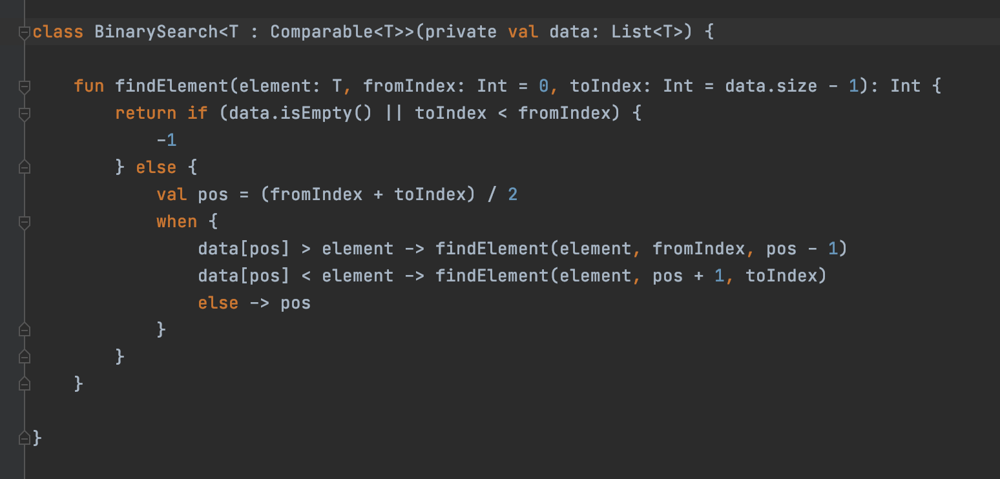
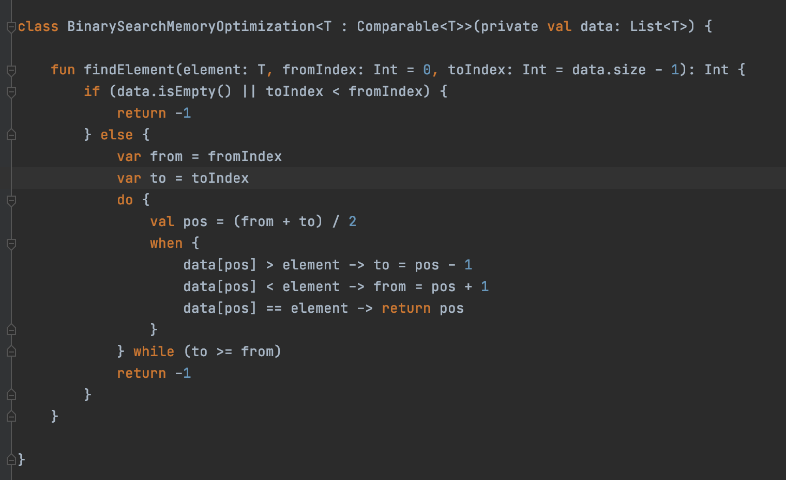

## Лаброраторная работа №1. Сложность алгоритмов и их оптимизация.
### Вариант 1 - Бинарный поиск
1) [Реализация алгоритма](BinarySearch.kt)
2) Сложность алгоритма O(log n), память O(log n), среднее время работы на одном наборе данных : 0.55 мс
3) [Оптимизация по памяти](BinarySearchMemoryOptimization.kt) - данная птимизация заключается в том, 
   что вместо рекурсивного вызова функции на меньшем отрезке будет использовать цикл while, 
   что поможет сократить использование памяти.
4) Сложность алгоритма O(log n), память O(1), среднее время работы на одном наборе данных : 0.53 мс
5) [Тесты](Tests.kt)
6) Сравнение реализаций
   
   Классическая реализация :
   
   Оптимизированная реализация :
   
### Вывод
Оптимизация по памяти уменьшила количество потребляемых ресурсов алгоритма, немного увеличила размер кода, 
а также незначительно повысила скорость работы.

[Отчет в формате pdf](Readme.pdf)