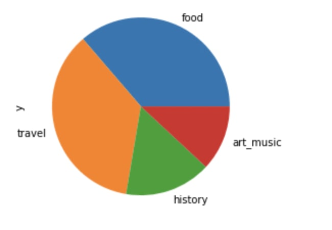
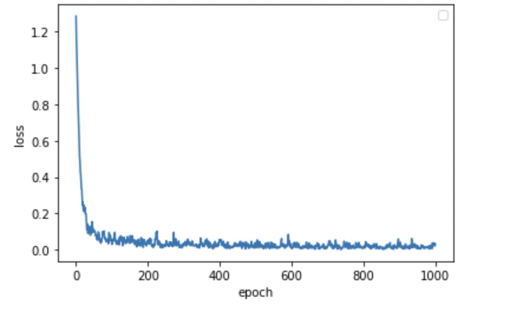

# Лабораторная работа 2
### Вариант 9 : [Hugging Face Speech-To-Text](https://huggingface.co/docs/transformers/model_doc/speech_to_text)  
команда : Баженов Егор, Воробьев Александр
***
#### Данные о модели
Модель Speech2Text была предложена на fairseq S2T: Fast Speech-to-Text Modeling with fairseq Чанг Хан Вангом, Юн Тангом, Сютай Ма, Энн Ву, Дмитрием Охонько, Хуаном Пино. 
Это модель seq2seq (encoder-decoder) на базе трансформеров, 
предназначенная для сквозного автоматического распознавания речи (ASR) и перевода речи (ST). 
Он использует сверточный понижающий дискретизатор для уменьшения длины речевых входных сигналов на 3/4 перед их подачей в кодер. 
Модель обучается со стандартной авторегрессией с потерей перекрестной энтропии и генерирует транскрипты/переводы авторегрессионно. 
Speech2Text был доработан для нескольких наборов данных для ASR и ST: LibriSpeech, CoVoST 2, MuST-C.  
Более подродно c моделью можно ознакомиться по [ссылке](https://huggingface.co/docs/transformers/model_doc/speech_to_text)
***
#### Тестирование
Тестирование было произведено на датасете [Youtube Videos Dataset](https://www.kaggle.com/datasets/rajatrc1705/youtube-videos-dataset)  
Предварительно требуется скачать размеченные видео, получить из них аудио. И
далее с помощью модели Speech2Text извлечь нужные нам эмбеддинги для классификации.

Диаграмма распределения классов в [файле с эбеддингами](all_ambs.csv).

***
Далее на pytorch реализуем нейронную сеть для классификации, и тренируем ее на полученных эмбеддингах.

Обученная модель на тесте показала такие метрики:
1. Accuracy: 0.5575221238938053
2. F1_score: 0.5594885226125675

График значения функции потерь при обучении сети.

Метрики получились неплохие, не не самые высокие. Это связано с тем, что модель для построения эмбеддингов аудио
не является лучшей в своей области, а также сам тренировочный датасет имеет не очень большие размеры.
***
[Реализация модели Speech2Text и нейронной сети для классификации](Sources.ipynb)
***
#### Выводы по работе
В результате работы мы научились классфицировать видео
с помощью нейронных сетей, которые работают с эмбеддингами аудио, полученных
моделью Hugging Face Speech-To-Text. Метрики в результате тестирования также вышли неплохими.

***
Источники, использованные в работе, указаны в виде ссылок
